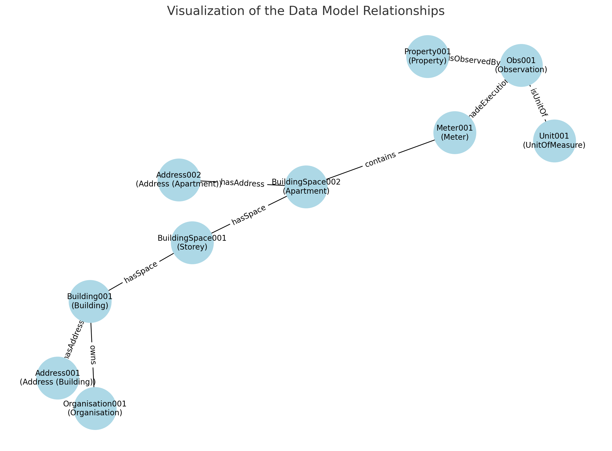

# Guide to Adding Data from a Meter

This guide outlines how to add data from a meter to the API and ensure relationships to existing entities are correct or create them if they do not exist.

## Table of Contents

1. [Add the Meter to the System](#1-add-the-meter-to-the-system-if-it-does-not-exist)
2. [Add Observations](#2-add-observations)
3. [Add Property Values](#3-add-property-values)
4. [Add Address Information](#4-add-address-information)
5. [Validate Relationships](#5-validate-relationships)
6. [Verify and Update Existing Entities](#6-verify-and-update-existing-entities)
7. [API Reference](#7-use-the-api-swagger-documentation-for-details)
8. [Visualization](#8-visualization)

## Steps to Add Meter Data

### 1. Add the Meter to the System (if it does not exist)

Use the following attributes to create a meter:

#### API Endpoint
```http
POST /api/v1/dataset/relational/{datasetId}
```

#### Request Body Example
```json
{
  "id": "Meter001",
  "type": "Meter",
  "name": "Heat Meter",
  "description": "Measures district heating consumption",
  "dateInstalled": "2024-01-01",
  "status": "active",
  "source": "user input",
  "dateCreated": "2024-01-01T00:00:00Z",
  "dateModified": "2024-01-01T00:00:00Z"
}
```

#### Relationships
Add relationships using the `Relations` table:

```json
{
  "entityFrom": "BuildingSpace002",
  "entity_classFrom": "BuildingSpace",
  "entityTo": "Meter001",
  "entity_classTo": "Meter",
  "type": "contains"
}
```

### 2. Add Observations

Observations link the meter to specific properties being measured.

#### API Endpoint
```http
POST /api/v1/dataset/relational/{datasetId}
```

#### Request Body Example
```json
{
  "id": "Obs001",
  "type": "Observation",
  "description": "Temperature measurement",
  "temporalType": "Instant",
  "dateCreated": "2024-01-01T00:00:00Z",
  "dateModified": "2024-01-01T00:00:00Z"
}
```

#### Relationships
```json
{
  "entityFrom": "Property001",
  "entity_classFrom": "Property",
  "entityTo": "Obs001",
  "entity_classTo": "Observation",
  "type": "isObservedBy"
},
{
  "entityFrom": "Meter001",
  "entity_classFrom": "Meter",
  "entityTo": "Obs001",
  "entity_classTo": "Observation",
  "type": "madeExecution"
},
{
  "entityFrom": "Unit001",
  "entity_classFrom": "UnitOfMeasure",
  "entityTo": "Obs001",
  "entity_classTo": "Observation",
  "type": "isUnitOf"
},
{
  "entityFrom": "BuildingSpace001",
  "entity_classFrom": "BuildingSpace",
  "entityTo": "Building001",
  "entity_classTo": "Building",
  "type": "hasSpace"
},
{
  "entityFrom": "BuildingSpace002",
  "entity_classFrom": "BuildingSpace",
  "entityTo": "BuildingSpace001",
  "entity_classTo": "BuildingSpace",
  "type": "hasSpace"
},
{
  "entityFrom": "Organisation001",
  "entity_classFrom": "Organisation",
  "entityTo": "Building001",
  "entity_classTo": "Building",
  "type": "owns"
},
{
  "entityFrom": "Address002",
  "entity_classFrom": "Address",
  "entityTo": "BuildingSpace002",
  "entity_classTo": "BuildingSpace",
  "type": "hasAddress"
}
```

### 3. Add Property Values

Property values represent the measurements taken by the meter.

#### API Endpoint
```http
POST /api/v1/dataset/timeseries/{datasetId}
```

#### Request Body Example
```json
{
  "procedureExecution": "Obs001",
  "value": 22.5,
  "timestamp": "2024-01-01T12:00:00Z",
  "source": "user input",
  "dateCreated": "2024-01-01T12:00:00Z",
  "dateModified": "2024-01-01T12:00:00Z"
}
```

### 4. Add Address Information

Add address details to entities where relevant.

#### Example: Adding an Address for the Building
```json
{
  "id": "Address001",
  "type": "PostalAddress",
  "streetAddress": "123 Main Street",
  "streetNr": "123",
  "addressLocality": "Copenhagen",
  "postalCode": "1000",
  "addressCountry": "Denmark",
  "district": "København",
  "dateCreated": "2024-01-01T00:00:00Z",
  "dateModified": "2024-01-01T00:00:00Z"
}
```

#### Example: Adding an Address for the Apartment
```json
{
  "id": "Address002",
  "type": "PostalAddress",
  "streetAddress": "123 Main Street, 1st Floor Left",
  "streetNr": "123",
  "addressLocality": "Copenhagen",
  "postalCode": "1000",
  "addressCountry": "Denmark",
  "district": "København",
  "dateCreated": "2024-01-01T00:00:00Z",
  "dateModified": "2024-01-01T00:00:00Z"
}
```

#### Relationships
```json
{
  "entityFrom": "Address001",
  "entity_classFrom": "Address",
  "entityTo": "Building001",
  "entity_classTo": "Building",
  "type": "hasAddress"
},
{
  "entityFrom": "Address002",
  "entity_classFrom": "Address",
  "entityTo": "BuildingSpace002",
  "entity_classTo": "BuildingSpace",
  "type": "hasAddress"
}
```

### 5. Validate Relationships

Ensure that all entities and relationships are correctly defined:

- **Apartment to Meter**: Use `type: contains`.
- **Property to Observation**: Use `type: isObservedBy`.
- **Meter to Observation**: Use `type: madeExecution`.
- **Observation to UnitOfMeasure**: Use `type: isUnitOf`.
- **BuildingSpace to Building**: Use `type: hasSpace`.
- **Apartment to Storey**: Use `type: hasSpace`.
- **Building to Address**: Use `type: hasAddress`.
- **Apartment to Address**: Use `type: hasAddress`.
- **Organisation to Building**: Use `type: owns`.

### 6. Verify and Update Existing Entities

If any required entities (e.g., `Building`, `Property`, `UnitOfMeasure`, `BuildingSpace`, `Address`, `Organisation`) do not exist, create them using the API with appropriate attributes.

#### Example: Adding an Organisation
```json
{
  "id": "Organisation001",
  "type": "Organisation",
  "name": "Building Owner Ltd.",
  "description": "Owner of the building and associated spaces",
  "source": "user input",
  "dateCreated": "2024-01-01T00:00:00Z",
  "dateModified": "2024-01-01T00:00:00Z"
}
```

### 7. Use the API Swagger Documentation for Details

Refer to the [API Swagger Documentation](https://api.centerdenmark.com/swagger-ui/index.html#/) for detailed endpoint specifications.

### 8. Visualization

Below is a visual representation of the relationships described in this guide:


