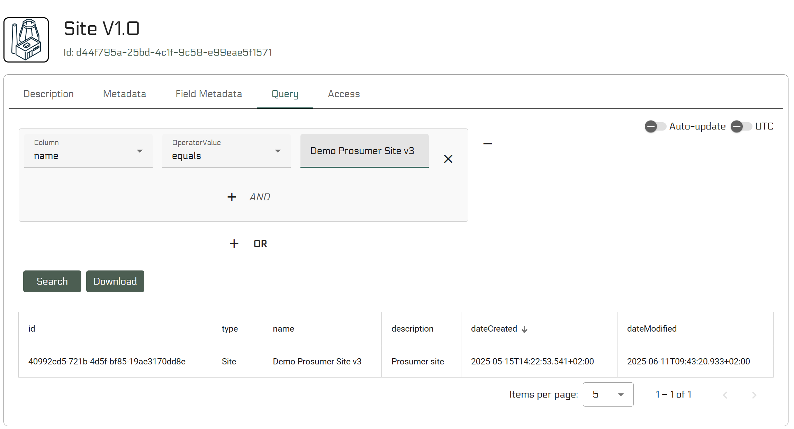
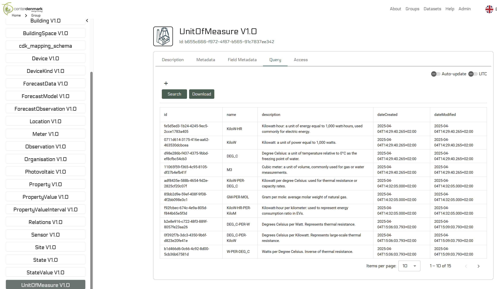
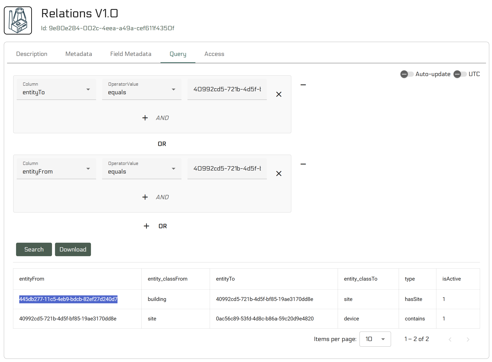
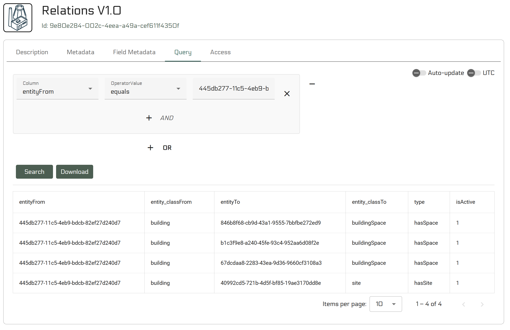
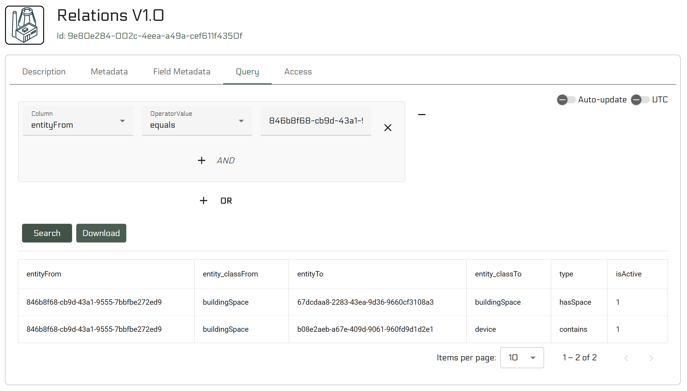

# Center Denmark API Data Consumer Guide: Retrieving Data

## Table of Contents
1. [General Concepts](#general-concepts)
   - [Access & Onboarding](#access--onboarding)
   - [Authentication](#authentication)
   - [Performance](#performance)
   - [API Coverage Limitations](#api-coverage-limitations)
2. [Getting Started](#getting-started)
3. [Using the Portal to Find Entity IDs](#using-the-portal-to-find-entity-ids)
4. [Context Endpoints](#context-endpoints)
   - [Get All Observations](#get-all-observations)
   - [Get All Forecast Observations](#get-all-forecast-observations)
5. [Time Series Data Endpoints](#time-series-data-endpoints)
   - [Query Device Data by Observation IDs](#query-device-data-by-observation-ids)
   - [Query Forecast Data by Forecast Observation IDs](#query-forecast-data-by-forecast-observation-ids)
6. [Static Entity Lookup](#static-entity-lookup)
   - [Properties](#properties)
   - [Units of Measure](#units-of-measure)
7. [Best Practices](#best-practices)

## General Concepts

### Access & Onboarding

To access the Center Denmark API as a data consumer, begin at [https://portal.centerdenmark.com/en-US/help](https://portal.centerdenmark.com/en-US/help). Contact the API provider by email to request access as a data consumer. Once approved, you'll receive access to a **dataset group** containing all entities relevant to your role.

Access begins with a [test group](https://portal.centerdenmark.com/en-US/group/b4737c93-b2b1-4ad0-a53a-93a262ab7f82) for experimenting with the API service at [test-transform.centerdenmark.com](https://test-transform.centerdenmark.com/swagger-ui/index.html). When you're ready, you can request access to the [production group](https://portal.centerdenmark.com/en-US/group/138149d0-46dc-4803-bfd1-79890079340a) and use the [production API service](https://transform.centerdenmark.com/swagger-ui/index.html#/).

### Authentication

After access is granted, you must generate an access token via the portal. This token must include **read** access to the entities in your dataset group. Data consumers typically only need read access.

### Performance

- **Context endpoints** (e.g., listing all devices or observations) are slower but provide essential metadata for understanding the data structure
- **Time series endpoints** are optimized for fast data retrieval once you have the necessary IDs
- Use context endpoints infrequently to get IDs, then use fast time series endpoints for actual data queries

### API Coverage Limitations

**Important:** The transformation endpoints for retrieving context (e.g., observations for sites, buildings, building spaces) only return information that is related to **one or more observations**. This means:

- **Available via transformation endpoints:** Sites, buildings, building spaces, devices, and forecasts that have associated observations
- **Only available via Portal/Base endpoints:** 
  - Sites without any devices/observations
  - Buildings without any devices/observations  
  - Building space relationships (e.g., two rooms connected via a shared wall) where no devices are present
  - Any structural relationships that don't involve devices with observations

**Recommendation:** Use transformation endpoints when you need observations and time series data. Use the Portal or base endpoints when you need to explore structural relationships or entities without observations.

## Getting Started

**For observation and time series data:**
1. **Use transformation endpoints** to find sites/buildings/spaces with observations
2. **Extract observation IDs** from the responses
3. **Use time series endpoints** to retrieve actual measurement data efficiently

**For structural relationships and entities without observations:**
1. **Use the Portal** to explore the complete data structure visually
2. **Use base endpoints** to programmatically access all entities and relationships
3. **Look up static entities** (properties, units) to understand data semantics

## Using the Portal to Find Entity IDs

**Portal URL:** [https://portal.centerdenmark.com/](https://portal.centerdenmark.com/)

The Center Denmark Portal provides a user-friendly web interface to explore the data model and find the IDs you need for API queries. This is often the easiest way to discover available sites and buildings.

### Finding Site IDs

Navigate to the "Sites" dataset in the dataset group to browse available sites. Each site will display its UUID, which you can use in API calls.



> Note: Any filter as above is available programatically via the base endpoints and to see how to perform the query programatically go to the "Access" tab, which is next to the "Query" tab that is shown above. The content in the "Access" tab is dynamic and changed with the filters added in the "Query" tab.

### Finding Static Entity IDs

The portal provides easy access to all static entities (Properties, Units of Measure, Accumulation Kinds, and Aggregation Kinds) that are centrally managed by the platform. Below shows an example of the units:



### Finding Relationships Between Entities

The portal allows you to explore the complete structural relationships between entities, which is especially useful for entities that don't have observations. Once you have found a site ID, you can traverse the data model hierarchy:

#### Step 1: Find Relations from the Site

Navigate to the "Relations" dataset and filter by `entityFrom` equal to your site ID. This will show all entities directly related to the site (buildings, weather areas, devices, etc.).



#### Step 2: Follow the Entity Hierarchy

For each related entity found in step 1, use the `entityTo` field value as the new search term. Search for all relations both to and from that entity:
- **From the entity**: Filter `entityFrom` by the entity ID to find what it contains
- **To the entity**: Filter `entityTo` by the entity ID to find what contains it



#### Step 3: Continue Through the Hierarchy

Repeat this process for each level of the hierarchy according to the data model diagram:
- **Site** → **Buildings** → **Building Spaces** → **Devices**
- **Site** → **Weather Areas** → **Devices**
- **Site** → **Devices** (direct relationship)

This final example shows that 1 of the rooms is related to a device and another building space, which is a wall, but this last fact would need to be looked up in the building entity.



> **Tip:** Refer to the [data model diagram](/data_model.md) to understand the expected relationship types and hierarchy. The `type` field in the Relations table indicates the nature of each relationship (e.g., "hasSpace", "contains", "owns").

### Benefits of Using the Portal

- **Visual data exploration**: See the hierarchical structure of sites, buildings, and devices
- **Easy ID discovery**: Copy UUIDs directly from the interface
- **Property lookup**: Understand what each observation measures
- **Static entity browsing**: Browse and search through centrally managed properties, units, and kinds
- **Relationship mapping**: See how entities are connected

## Context Endpoints

**Important Note:** These endpoints only return entities that have associated observations. For complete structural information (including entities without observations), use the Portal or base endpoints.

### Get All Observations

To get all observations, query them through site, building, or building space endpoints. These will only return locations that actually have observations:

**Site Observations:** `GET /api/elexia/transformation/site/{siteId}/observations`

Returns all observations for a site including those in buildings and building spaces within the site. **Only works if the site has devices with observations.**

**Building Observations:** `GET /api/elexia/transformation/building/{buildingId}/observations`

Returns all observations for a building including those in building spaces within the building. **Only works if the building has devices with observations.**

**Building Space Observations:** `GET /api/elexia/transformation/building/space/{buildingSpaceId}/observations`

Returns all observations for a specific building space. **Only works if the building space has devices with observations.**

**Example Response:** Based in data from [the data provider guide](/guides/data%20provider/transformation_endpoints_guide.md)
```json
{
  "site": {
    "id": "40992cd5-721b-4d5f-bf85-19ae3170dd8e",
    "type": "Site",
    "name": "Demo Prosumer Site v3",
    "description": "Prosumer site"
  },
  "observations": [
    {
      "observation": {
        "id": "6d60ddd8-bcb4-40ee-b415-aec965114189",
        "type": "METER"
      },
      "property": {
        "id": "7d9129a5-95b3-4ad7-95e3-a2ab14dede55",
        "type": "Property",
        "name": "Energy",
        "description": "The capacity of a system to perform work.",
        "dateCreated": "2025-04-04T13:11:06.097Z",
        "dateModified": "2025-04-04T13:11:06.097Z"
      },
      "unitOfMeasure": {
        "id": "fe5d5ed3-1b24-4245-9ec5-2cce1783a405",
        "name": "KiloW-HR",
        "description": "Kilowatt-hour: a unit of energy equal to 1,000 watt-hours, used commonly for electric energy."
      },
      "deviceId": "b08e2aeb-a67e-409d-9061-960fd9d1d2e1",
      "buildingId": "445db277-11c5-4eb9-bdcb-82ef27d240d7"
    },
    {
      "observation": {
        "id": "dc1cefad-5ba4-44e1-918d-9e9872669644",
        "type": "METER"
      },
      "property": {
        "id": "fbf8aa3d-0776-4b59-9ee6-f596b0f0981a",
        "type": "Property",
        "name": "ActivePower",
        "description": "The actual power which performs useful work in a system.",
        "dateCreated": "2025-04-04T13:11:06.097Z",
        "dateModified": "2025-04-04T13:11:06.097Z"
      },
      "unitOfMeasure": {
        "id": "0711d614-3175-416e-aa62-463530dcbcea",
        "name": "KiloW",
        "description": "Kilowatt: a unit of power equal to 1,000 watts."
      },
      "deviceId": "b08e2aeb-a67e-409d-9061-960fd9d1d2e1",
      "buildingId": "445db277-11c5-4eb9-bdcb-82ef27d240d7"
    },
    {
      "observation": {
        "id": "8569ee65-c0da-4fcc-9cf7-1d94e32042bc",
        "type": "SENSOR"
      },
      "property": {
        "id": "8a4e4cac-e568-4b88-8955-e04f65d81263",
        "type": "Property",
        "name": "Temperature",
        "description": "The degree of hotness or coldness measured on a definite scale.",
        "dateCreated": "2025-04-04T13:11:06.097Z",
        "dateModified": "2025-04-04T13:11:06.097Z"
      },
      "unitOfMeasure": {
        "id": "d98e286b-f437-4375-9bbd-ef8cfbc54cb3",
        "name": "DEG_C",
        "description": "Degree Celsius: a unit of temperature relative to 0°C as the freezing point of water."
      },
      "deviceId": "d4b4d8e8-f4f8-4493-ba43-fd5b1b183df8",
      "buildingId": "445db277-11c5-4eb9-bdcb-82ef27d240d7"
    },
    {
      "observation": {
        "id": "7fcf568a-5169-4846-9aec-e6e5c5400bab",
        "type": "SENSOR"
      },
      "property": {
        "id": "f319f512-13d7-4fc8-b4eb-8da8624d0783",
        "type": "Property",
        "name": "RelativeHumidity",
        "description": "The ratio of the current absolute humidity to the highest possible absolute humidity at that temperature.",
        "dateCreated": "2025-04-07T09:28:35.997Z",
        "dateModified": "2025-04-07T09:28:35.997Z"
      },
      "unitOfMeasure": {
        "id": "b0a86102-bb5e-41a8-bf7a-b72601a16a12",
        "name": "PERCENT",
        "description": "A unit representing one part in a hundred."
      },
      "deviceId": "d4b4d8e8-f4f8-4493-ba43-fd5b1b183df8",
      "buildingId": "445db277-11c5-4eb9-bdcb-82ef27d240d7"
    },
    {
      "observation": {
        "id": "52db51de-3c6c-44d3-bb37-5dfdffd01910",
        "type": "SENSOR"
      },
      "property": {
        "id": "cddc4551-5a3a-4dc5-99ef-ff256edcb2ae",
        "type": "Property",
        "name": "CO2Equivalent",
        "description": "A measure used to compare the emissions from various greenhouse gases based on their global warming potential.",
        "dateCreated": "2025-04-07T09:28:35.997Z",
        "dateModified": "2025-04-07T09:28:35.997Z"
      },
      "unitOfMeasure": {
        "id": "809de085-a6aa-4b4b-b41a-1c94f4c9cb40",
        "name": "GM-PER-M3",
        "description": "Gram per cubic meter, used to measure concentration of a substance in air."
      },
      "deviceId": "0ac56c89-53fd-4d8c-b86a-59c20d9e4820",
      "siteId": "40992cd5-721b-4d5f-bf85-19ae3170dd8e"
    },
    {
      "observation": {
        "id": "effdb4c3-6d98-44f2-9903-5eedb917bb94",
        "type": "SENSOR"
      },
      "property": {
        "id": "bd6789bb-14b5-4c88-839f-975535fa4196",
        "type": "Property",
        "name": "AbsoluteHumidity",
        "description": "The total mass of water vapor present in a given volume of air.",
        "dateCreated": "2025-04-07T09:28:35.997Z",
        "dateModified": "2025-04-07T09:28:35.997Z"
      },
      "unitOfMeasure": {
        "id": "809de085-a6aa-4b4b-b41a-1c94f4c9cb40",
        "name": "GM-PER-M3",
        "description": "Gram per cubic meter, used to measure concentration of a substance in air."
      },
      "deviceId": "0ac56c89-53fd-4d8c-b86a-59c20d9e4820",
      "siteId": "40992cd5-721b-4d5f-bf85-19ae3170dd8e"
    }
  ]
}
```

### Get All Forecast Observations

**Endpoint:** `POST /api/elexia/transformation/forecast/by-id`

To get forecast observations, you first need to get forecasts by their IDs, then extract the forecast observation IDs from the response.

**Example Request:**
```json
["forecast-uuid-505"]
```

**Example Response:**
```json
{
  "forecastResponseDTOS": [
    {
      "forecastModel": {
        "id": "forecast-uuid-505",
        "name": "Indoor Temperature Forecast Model v3",
        "modelType": "ML"
      },
      "deviceIds": ["device-uuid-101"],
      "forecastObservationIds": ["forecast-obs-uuid-606"]
    }
  ]
}
```

## Time Series Data Endpoints

These endpoints are optimized for fast retrieval of actual measurement data.

### Query Device Data by Observation IDs

**Endpoint:** `POST /api/elexia/transformation/device/data/query/id`

This is the fastest way to retrieve time series data once you have observation IDs.

**Example Request:**
```json
{
  "observationIds": ["obs-uuid-202", "obs-uuid-303"],
  "startTime": "2024-01-01T00:00:00Z",
  "endTime": "2024-01-01T23:59:59Z"
}
```

**Example Response:**
```json

[
    {
      "procedureExecution": "obs-uuid-202",
      "timestamp": "2024-01-01T08:00:00Z",
      "value": 22.1
    },
    {
      "procedureExecution": "obs-uuid-202",
      "timestamp": "2024-01-01T07:00:00Z",
      "value": 22.4
    },
]
```

### Query Forecast Data by Forecast Observation IDs

**Endpoint:** `POST /api/elexia/transformation/forecast/data/query/id`

Retrieve forecast data for specific forecast observation IDs.

**Example Request:**
```json
{
  "observationIds": ["forecast-obs-uuid-606"],
  "startTime": "2024-01-02T00:00:00Z",
  "endTime": "2024-01-02T23:59:59Z"
}
```

**Example Response:**
```json
[
  {
    "procedureExecution": "25cbfdc9-b910-40bd-b0f0-ce897d56c315",
    "value": 2,
    "timestamp": "2025-06-10T11:46:24.773Z",
    "version": 2
  },
  {
    "procedureExecution": "25cbfdc9-b910-40bd-b0f0-ce897d56c315",
    "value": 2,
    "timestamp": "2025-06-10T11:45:24.773Z",
    "version": 1
  },
  {
    "procedureExecution": "25cbfdc9-b910-40bd-b0f0-ce897d56c315",
    "value": 2,
    "timestamp": "2025-06-10T11:44:24.773Z",
    "version": 0
  }
]
```

## Static Entity Lookup

The static entities (Properties, Units of Measure, Accumulation Kinds, and Aggregation Kinds) are best discovered through the Center Denmark Portal, which provides a user-friendly interface for browsing and searching these centrally managed entities.

### Properties

**Recommended approach:** Use the portal to browse available properties and copy their UUIDs.

Properties are also included in observation responses, so you can extract property information from the observation endpoints if needed.

### Units of Measure

**Recommended approach:** Use the portal to browse available units of measure and copy their UUIDs.

Units of measure are also included in observation responses, so you can extract unit information from the observation endpoints if needed.

### Accumulation and Aggregation Kinds

**Recommended approach:** Use the portal to browse available accumulation and aggregation kinds and copy their UUIDs.

These are centrally managed entities that define how data is accumulated and aggregated, and are essential for understanding the semantics of observations and forecasts.

## Best Practices

1. **Start with transformation endpoints** if you need observation and time series data
2. **Use the Portal** to explore the complete data structure including entities without observations
3. **Use base endpoints** for programmatic access to all entities and relationships
4. **Cache context data** locally since it changes infrequently
5. **Use observation IDs** for fast time series queries
6. **Query reasonable time ranges** to avoid overwhelming the system
7. **Understand the data semantics** by looking up properties, units, and accumulation/aggregation kinds

## Example Workflows

### Workflow 1: Getting Time Series Data (Use Transformation Endpoints)

1. **Get observations for a site** using `/api/elexia/transformation/site/{siteId}/observations`
2. **Extract observation IDs** from the response
3. **Query time series data** using observation IDs with `/api/elexia/transformation/device/data/query/id`
4. **For forecasts:** Get forecast models, extract forecast observation IDs, then query forecast data

### Workflow 2: Exploring Complete Structure (Use Portal/Base Endpoints)

1. **Use the Portal** to browse all sites, buildings, and building spaces (including those without observations)
2. **Explore relationships** between entities (e.g., which rooms are connected by walls)
3. **Use base endpoints** for programmatic access to complete structural information
4. **Identify entities with observations** using transformation endpoints when needed

This approach ensures you can access both observational data efficiently and explore the complete structural relationships in the data model.
