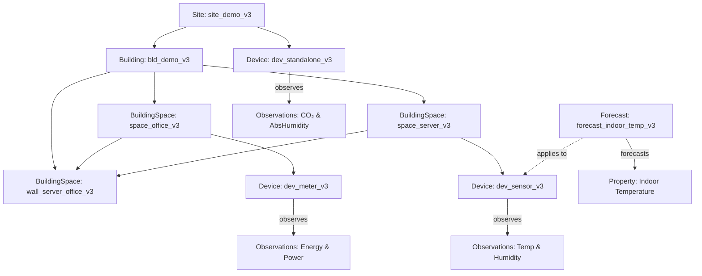

# Center Denmark API Transformation Guide: Posting Data

## Table of Contents
1. [General Concepts](#general-concepts)
   - [Access & Onboarding](#access--onboarding)
   - [Entity Behavior](#entity-behavior)
   - [Identifier Mapping](#identifier-mapping)
   - [Performance](#performance)
   - [Field Flexibility](#field-flexibility)
2. [Example Scenario](#example-scenario)
3. [Step 1: Add Location Information (Buildings and Spaces)](#step-1-add-location-information-buildings-and-spaces)
4. [Step 2: Add Location Information (Sites)](#step-2-add-location-information-sites)
5. [Step 3: Add Devices](#step-3-add-devices)
6. [Step 4: Add Device Data](#step-4-add-device-data)
7. [Step 5: Query Device Data](#step-5-query-device-data)
8. [Step 6: Forecasting Data](#step-6-forecasting-data)

## General Concepts

### Access & Onboarding

To access the Center Denmark API and portal, begin at [https://portal.centerdenmark.com/en-US/help](https://portal.centerdenmark.com/en-US/help). Contact the API provider by email to request access as a data provider, data consumer, or both. Once approved, you’ll receive access to a **dataset group** containing all entities relevant to your role. You can explore the data interactively in the portal. Access begins with a [test group](https://portal.centerdenmark.com/en-US/group/b4737c93-b2b1-4ad0-a53a-93a262ab7f82) group for experimenting with dummy data and the API service is given [here](https://test-transform.centerdenmark.com/swagger-ui/index.html). When you're ready, you can request access to a [production group](https://portal.centerdenmark.com/en-US/group/138149d0-46dc-4803-bfd1-79890079340a) and reuse the same workflow, but with [this API service](https://transform.centerdenmark.com/swagger-ui/index.html#/).

After access is granted, you must generate an access token via the portal. This token must include **read** and/or **write** access to the entities in your dataset group:

> * **Write access** is required only for data providers.
> * **Write access is never needed** for static entities (such as properties).

### Entity Behavior

> **Entity updates:** If an entity is posted again with the same `sourceId` and `organisationName`, any updated field values will overwrite the existing data. This allows updates to previously posted entities. To add relations (e.g., link a site to a new building), simply post the entity again with the additional relations included.

> **Static entities:** Some entities — particularly those under `properties` such as `Property`, `UnitOfMeasure`, `AccumulationKind`, and `AggregationKind` — are managed centrally by the API provider. These values are predefined and cannot be changed by users. They must be selected from the lookup tables available via the portal.

### Identifier Mapping

All entities in this guide are posted using `sourceId` and `organisationName`. This combination uniquely identifies records as defined by the data provider. Internally, the API maps this pair to a stable UUID (`id`) used for referencing objects. You may use either method (sourceId + organisationName or UUID) for referencing existing objects.

### Performance

Endpoints that provide context (e.g., listing all devices or observations for a site or building) are significantly slower than endpoints that return only time series data. These context endpoints should be used **infrequently** to retrieve the necessary observation or device identifiers. Once obtained, you should use the fast data query endpoint [`/api/elexia/transformation/device/data/query/id`](https://transform.centerdenmark.com/swagger-ui/index.html#/Elexia%3A%20Device/deviceDataQuery_1) with specific `observationId`s to efficiently retrieve data.

### Field Flexibility

In the Swagger documentation, all fields for entities are displayed. However, it is not necessary to include all fields when posting data if they are not relevant. For example, if a `Device` does not have a specific location, the `Location` object may be omitted.

For fields within objects, refer to this guide to determine which fields are required.

**Note**: In the current version, the __type__ field must always be provided. However, in future versions, this will no longer be mandatory except for `Device` entities.

## Example Scenario

The guide includes concrete examples that simulate a real-world setup:

* A prosumer site named `Demo Prosumer Site v3`
* A building (`Demo HQ v3`) with two rooms (`Office Room v3` and `Server Room v3`) and a shared wall
* Three devices: a power meter in the office, a temperature/humidity sensor in the server room, and a standalone air quality sensor not linked to a building
* All data is provided by a fictional organisation identified by `organisationName: "dataprovider_v3"`

These examples are crafted to demonstrate different valid ways of modeling devices in relation to a site, building, or building space.

---

## 🔹 Overview



The API uses a structured model of:

* **Sites**: Top-level physical or logical locations
* **Buildings**: Located within sites
* **BuildingSpaces**: Rooms, walls, sections inside buildings
* **Devices**: Sensors/meters linked to one of the above
* **Properties**: What a device measures (e.g. temperature, power)
* **Forecasts**: Forecasted values for properties at sites, buildings, or devices

Devices must be linked to only **one level** of location:

* ✅ `site`
* ✅ `site` → `building`
* ✅ `site` → `building` → `buildingSpace`

You **must not** specify multiple levels at once (e.g., both `building` and `buildingSpace`).

---

## Step 1: Add Location Information (Buildings and Spaces)

This step can be repeated to add additional buildings at any time. Like other entities, re-posting a building with new fields or updated relations (e.g., new buildingSpaces) will update the existing record rather than create a duplicate.

Use the endpoint /api/elexia/transformation/building

This step creates the building and its associated rooms and walls. The building will be connected to a site in the next step.

```json
{
  "organisationName": "dataprovider_v3",
  "building": {
    "sourceId": "bld_demo_v3",
    "type": "Building",
    "name": "Demo HQ v3",
    "description": "Main building for demonstration (v3)",
    "livingArea": 500.0
  },
  "buildingSpaces": [
    {
      "sourceId": "space_office_v3",
      "type": "BuildingSpace",
      "name": "Office Room v3",
      "buildingSpaceKind": "Space",
      "area": 60.0,
      "airVolume": 150.0,
      "relatedSourceIds": ["wall_shared_v3"]
    },
    {
      "sourceId": "space_server_v3",
      "type": "BuildingSpace",
      "name": "Server Room v3",
      "buildingSpaceKind": "Space",
      "area": 40.0,
      "airVolume": 100.0,
      "relatedSourceIds": ["wall_shared_v3"]
    },
    {
      "sourceId": "wall_shared_v3",
      "type": "BuildingSpace",
      "name": "Shared Wall v3",
      "buildingSpaceKind": "Wall"
    }
  ]
}
```

---

## Step 2: Add Location Information (Sites)

> **Note:** This endpoint is planned but not yet implemented.
> When available, it will allow posting a site and referencing any buildings it contains using `sourceId`.
> The `organisationName` inside the `buildings` list does **not** need to match the root `organisationName`. It refers to the organisation responsible for each referenced building.

Use the endpoint /api/elexia/transformation/site

```json
{
  "organisationName": "dataprovider_v3",
  "site": {
    "sourceId": "site_demo_v3",
    "type": "Site",
    "name": "Demo Prosumer Site v3",
    "description": "Prosumer site"
  },
  "buildings": [{ "sourceId": "bld_demo_v3",
                  "organisationName": "dataprovider_v3" // Is not needed if it is the same as organisationName in the root
              }]
}
```

---

## Step 3: Add Devices

> **Note:** The UUIDs used in the `properties` array (e.g., `propertyId`, `unitOfMeasureId`, `accumulationKindId`, `aggregationKindId`) must refer to existing rows in the corresponding tables in the Center Denmark portal. These values must be looked up in the portal to ensure the correct semantics for each device's observations. (A link to the portal will be added here.)

> **Source ID Mapping:** The `sourceId` is the identifier used by the data provider (specified via `organisationName`). Internally, this combination of `sourceId` and `organisationName` is mapped to a UUID. In all places where existing objects are referenced using `sourceId` and `organisationName`, it is also possible to reference them directly using the internal UUID (`id`) maintained by the API.

Use the endpoint /api/elexia/transformation/device

You can post multiple devices in a single request. The following example includes three devices:

* A power meter in a building space
* A sensor in another building space
* A standalone air quality sensor linked only to the site

```json
[
  {
    "sourceId": "dev_meter_v3",
    "organisationName": "dataprovider_v3",
    "name": "Main Power Meter v3",
    "description": "Electricity meter in Office Room v3",
    "status": "Active",
    "type": {
      "deviceType": "METER",
      "dateInstalled": "2024-01-15T00:00:00Z"
    },
    "deviceKind": {
      "sourceId": "kind_meter_x200_v3",
      "type": "DeviceKind",
      "modelName": "X200 v3",
      "manufacturer": "PowerTech"
    },
    "buildingSpace": {
      "sourceId": "space_office_v3",
      "type": "BuildingSpace"
    },
    "properties": [
      {
        "propertyId": "7d9129a5-95b3-4ad7-95e3-a2ab14dede55",
        "unitOfMeasureId": "fe5d5ed3-1b24-4245-9ec5-2cce1783a405",
        "accumulationKindId": "118ca8d9-cd6b-464d-8e7f-3cb1206c40e6",
        "aggregationKindId": "3ec799fc-56ad-4d07-a056-2473394d5801"
      },
      {
        "propertyId": "fbf8aa3d-0776-4b59-9ee6-f596b0f0981a",
        "unitOfMeasureId": "0711d614-3175-416e-aa62-463530dcbcea",
        "accumulationKindId": "15e95acc-48b7-4756-a264-c0cac5461125",
        "aggregationKindId": "f5218a15-9b22-4cc5-94db-4e106bae169d"
      }
    ]
  },
  {
    "sourceId": "dev_sensor_v3",
    "organisationName": "dataprovider_v3",
    "name": "Temp Sensor SR v3",
    "description": "Temperature sensor in Server Room v3",
    "status": "Active",
    "type": {
      "deviceType": "SENSOR",
      "dateInstalled": "2024-01-10T00:00:00Z"
    },
    "deviceKind": {
      "sourceId": "kind_sensor_ts300_v3",
      "type": "DeviceKind",
      "modelName": "TS-300 v3",
      "manufacturer": "EnviroTech"
    },
    "buildingSpace": {
      "sourceId": "space_server_v3",
      "type": "BuildingSpace"
    },
    "properties": [
      {
        "propertyId": "8a4e4cac-e568-4b88-8955-e04f65d81263",
        "unitOfMeasureId": "d98e286b-f437-4375-9bbd-ef8cfbc54cb3",
        "accumulationKindId": "15e95acc-48b7-4756-a264-c0cac5461125",
        "aggregationKindId": "f5218a15-9b22-4cc5-94db-4e106bae169d"
      },
      {
        "propertyId": "f319f512-13d7-4fc8-b4eb-8da8624d0783",
        "unitOfMeasureId": "b0a86102-bb5e-41a8-bf7a-b72601a16a12",
        "accumulationKindId": "15e95acc-48b7-4756-a264-c0cac5461125",
        "aggregationKindId": "f5218a15-9b22-4cc5-94db-4e106bae169d"
      }
    ]
  },
  {
    "sourceId": "dev_standalone_v3",
    "organisationName": "dataprovider_v3",
    "name": "Air Quality Sensor v3",
    "description": "Standalone sensor for CO₂ and humidity (not tied to a room)",
    "status": "Active",
    "type": {
      "deviceType": "SENSOR",
      "dateInstalled": "2024-01-12T00:00:00Z"
    },
    "deviceKind": {
      "sourceId": "kind_air_sensor_v3",
      "type": "DeviceKind",
      "modelName": "AQ-100 v3",
      "manufacturer": "AirWatch"
    },
    "site": {
      "sourceId": "site_demo_v3",
      "type": "Site"
    },
    "properties": [
      {
        "propertyId": "cddc4551-5a3a-4dc5-99ef-ff256edcb2ae",
        "unitOfMeasureId": "809de085-a6aa-4b4b-b41a-1c94f4c9cb40",
        "accumulationKindId": "15e95acc-48b7-4756-a264-c0cac5461125",
        "aggregationKindId": "f5218a15-9b22-4cc5-94db-4e106bae169d"
      },
      {
        "propertyId": "bd6789bb-14b5-4c88-839f-975535fa4196",
        "unitOfMeasureId": "809de085-a6aa-4b4b-b41a-1c94f4c9cb40",
        "accumulationKindId": "15e95acc-48b7-4756-a264-c0cac5461125",
        "aggregationKindId": "f5218a15-9b22-4cc5-94db-4e106bae169d"
      }
    ]
  }
]
```

---

## Step 4: Add Device Data

This step shows how to send actual observations to the devices. Each entry contains the device `sourceId`, the `organisationName`, and a list of timestamped values for the device's registered properties. Use the endpoint /api/elexia/transformation/device/data.

```json
[
  {
    "sourceId": "dev_sensor_v3",
    "organisationName": "dataprovider_v3",
    "data": [
      {
        "time": "2025-05-06T08:00:00Z",
        "values": [
          {
            "propertyId": "8a4e4cac-e568-4b88-8955-e04f65d81263",
            "value": 22.1
          },
          {
            "propertyId": "f319f512-13d7-4fc8-b4eb-8da8624d0783",
            "value": 46.5
          }
        ]
      },
      {
        "time": "2025-05-06T09:00:00Z",
        "values": [
          {
            "propertyId": "8a4e4cac-e568-4b88-8955-e04f65d81263",
            "value": 22.4
          },
          {
            "propertyId": "f319f512-13d7-4fc8-b4eb-8da8624d0783",
            "value": 47.0
          }
        ]
      }
    ]
  }
]
```

---

## Step 5: Query Device Data

This step demonstrates how to query data for a specific device or retrieve all observations in a site and query data using observation IDs.

### Sub-step 1: Query Data for a Specific Device

This sub-step shows how to query data for a specific device using the `/api/elexia/transformation/device/data/query` endpoint.

#### Example Request

```json
{
  "sourceId": "dev_sensor_v3",
  "organisationName": "dataprovider_v3",
  "startTime": "2025-05-06T08:00:00Z",
  "endTime": "2025-05-06T09:00:00Z"
}
```

#### Example Response

```json
{
  "sourceId": "dev_sensor_v3",
  "organisationName": "dataprovider_v3",
  "data": [
    {
      "time": "2025-05-06T08:00:00Z",
      "values": [
        {
          "propertyId": "8a4e4cac-e568-4b88-8955-e04f65d81263",
          "value": 22.1
        },
        {
          "propertyId": "f319f512-13d7-4fc8-b4eb-8da8624d0783",
          "value": 46.5
        }
      ]
    },
    {
      "time": "2025-05-06T09:00:00Z",
      "values": [
        {
          "propertyId": "8a4e4cac-e568-4b88-8955-e04f65d81263",
          "value": 22.4
        },
        {
          "propertyId": "f319f512-13d7-4fc8-b4eb-8da8624d0783",
          "value": 47.0
        }
      ]
    }
  ]
}
```

### Sub-step 2: Retrieve Observations for a Site and Query Data

This sub-step demonstrates how to retrieve all observations in a site using the `/api/elexia/transformation/site/observations` endpoint and then query data using the observation IDs with the `/api/elexia/transformation/device/data/query/id` endpoint.

#### Step 1: Retrieve Observations for a Site

Use the `/api/elexia/transformation/site/{sourceId}/{organisationName}/observations` endpoint to get all observations for a site.

##### Example Request

```json
{
  "sourceId": "site_demo_v3",
  "organisationName": "dataprovider_v3"
}
```

#### Step 2: Query Data Using Observation IDs

Use the `/api/elexia/transformation/device/data/query/id` endpoint to query data for the retrieved observation IDs.

##### Example Request

```json
{
  "observationIds": ["obs_energy_123", "obs_climate_456"],
  "startTime": "2025-05-06T08:00:00Z",
  "endTime": "2025-05-06T09:00:00Z"
}
```

This sub-step allows you to retrieve all observations for a site and query data for those observations.

---

## Step 6: Forecasting Data

This step demonstrates how to post and query forecasting data using the transformation endpoints.

### Posting a Forecast Model

Use the endpoint `/api/elexia/transformation/forecast` to post a new forecast model. The payload structure mimics the Device payload: you must provide `organisationName`, `sourceId`, a `devices` array, and a `properties` array. For each property in the array, a corresponding forecast observation will be created. The `devices` array specifies which device(s) the forecast applies to.

> **Note:** The `period` field is an ISO 8601 duration string that indicates the period that each forecast will cover (e.g., `"PT3H"` means each forecast covers a 3-hour period).

```json
{
  "organisationName": "dataprovider_v3",
  "sourceId": "forecast_indoor_temp_v3",
  "name": "Indoor Temperature Forecast Model v3",
  "modelType": "ML",
  "modelVersion": "1.0.0",
  "period": "PT3H",
  "devices": [
    {
      "sourceId": "dev_sensor_v3",
      "organisationName": "dataprovider_v3"
    }
  ],
  "properties": [
    {
      "propertyId": "8a4e4cac-e568-4b88-8955-e04f65d81263", // Indoor Temperature
      "unitOfMeasureId": "d98e286b-f437-4375-9bbd-ef8cfbc54cb3", // Celsius
      "aggregationKindId": "f5218a15-9b22-4cc5-94db-4e106bae169d", // Average
      "accumulationKindId": "ba5745a5-9633-406f-ac8c-6f9e4aa0cfd8"
    }
  ]
}
```

> For each property in the `properties` array, a forecast observation will be created and linked to the forecast model and the specified device(s).

### Posting a Forecast Observation

*Normally, you do not need to post forecast observations directly, as they are created automatically when posting a forecast model with properties.*

### Posting Forecast Data

Use the endpoint `/api/elexia/transformation/forecastdata` to post forecasted values.

> **Note:** The `version` field must be an integer. For each (`sourceId`, `organisationName`, `timestamp`, `propertyId`) combination (identifying the forecast observation and property), a new forecast value must have a strictly higher version than any previous value for that timestamp.

The payload structure for posting forecast data mimics the structure in Step 4 (device data), grouping values by forecast observation and timestamp:

#### First payload (initial forecast):

```json
[
  {
    "sourceId": "forecast_indoor_temp_v3",
    "organisationName": "dataprovider_v3",
    "data": [
      {
        "time": "2024-01-02T12:00:00Z",
        "values": [
          { "propertyId": "8a4e4cac-e568-4b88-8955-e04f65d81263", "value": 21.5, "version": 1 }
        ]
      },
      {
        "time": "2024-01-02T13:00:00Z",
        "values": [
          { "propertyId": "8a4e4cac-e568-4b88-8955-e04f65d81263", "value": 21.8, "version": 1 }
        ]
      },
      {
        "time": "2024-01-02T14:00:00Z",
        "values": [
          { "propertyId": "8a4e4cac-e568-4b88-8955-e04f65d81263", "value": 22.0, "version": 1 }
        ]
      }
    ]
  }
]
```

#### Second payload (updated forecast for same timestamps):

```json
[
  {
    "sourceId": "forecast_indoor_temp_v3",
    "organisationName": "dataprovider_v3",
    "data": [
      {
        "time": "2024-01-02T12:00:00Z",
        "values": [
          { "propertyId": "8a4e4cac-e568-4b88-8955-e04f65d81263", "value": 21.7, "version": 2 }
        ]
      },
      {
        "time": "2024-01-02T13:00:00Z",
        "values": [
          { "propertyId": "8a4e4cac-e568-4b88-8955-e04f65d81263", "value": 22.0, "version": 2 }
        ]
      },
      {
        "time": "2024-01-02T14:00:00Z",
        "values": [
          { "propertyId": "8a4e4cac-e568-4b88-8955-e04f65d81263", "value": 22.3, "version": 2 }
        ]
      }
    ]
  }
]
```

### Getting an Overview of Forecasts for a Device

You can get an overview of all forecasts associated with a device using the following endpoint:

- **Endpoint:** `/api/elexia/transformation/device/{sourceId}/{organisationName}/forecasts`
- **Method:** `GET`

This will return all forecast models and their associated forecast observations for the specified device.

> **Note:** Similar endpoints exist for other entities:
> - `/api/elexia/transformation/building/{sourceId}/{organisationName}/forecasts`
> - `/api/elexia/transformation/buildingspace/{sourceId}/{organisationName}/forecasts`
> - `/api/elexia/transformation/site/{sourceId}/{organisationName}/forecasts`
>
> These endpoints allow you to get an overview of all forecasts linked to a Building, BuildingSpace, or Site.

#### Example Request

```
GET /api/elexia/transformation/device/dev_sensor_v3/dataprovider_v3/forecasts
```

#### Example Response

```json
[
  {
    "forecast": {
      "sourceId": "forecast_indoor_temp_v3",
      "name": "Indoor Temperature Forecast Model v3",
      "modelType": "ML",
      "modelVersion": "1.0.0",
      "period": "PT3H",
      "properties": [
        {
          "propertyId": "8a4e4cac-e568-4b88-8955-e04f65d81263",
          "unitOfMeasureId": "d98e286b-f437-4375-9bbd-ef8cfbc54cb3",
          "aggregationKindId": "f5218a15-9b22-4cc5-94db-4e106bae169d",
          "accumulationKindId": "ba5745a5-9633-406f-ac8c-6f9e4aa0cfd8"
        }
      ]
    }
  }
]
```


### Querying Forecast Data

You can query forecast data using the `/api/elexia/transformation/forecastdata/query` endpoint.

The payload format for querying forecast data matches the format used for querying device data, but uses `forecastId` instead of `deviceId`:

```json
{
  "sourceId": "forecast_indoor_temp_v3",
  "organisationName": "dataprovider_v3",
  "properties": [
    "8a4e4cac-e568-4b88-8955-e04f65d81263"
  ],
  "startTime": "2024-01-02T12:00:00Z",
  "endTime": "2024-01-02T15:00:00Z"
}
```

#### Example Response

> **Note:** The response returns all versions of forecast values for each timestamp and property.

```json
{
  "sourceId": "forecast_indoor_temp_v3",
  "forecastId": "3fa85f64-5717-4562-b3fc-2c963f66afa6",
  "data": [
    {
      "time": "2024-01-02T12:00:00Z",
      "values": [
        { "propertyId": "8a4e4cac-e568-4b88-8955-e04f65d81263", "value": 21.5, "version": 1 },
        { "propertyId": "8a4e4cac-e568-4b88-8955-e04f65d81263", "value": 21.7, "version": 2 }
      ]
    },
    {
      "time": "2024-01-02T13:00:00Z",
      "values": [
        { "propertyId": "8a4e4cac-e568-4b88-8955-e04f65d81263", "value": 21.8, "version": 1 },
        { "propertyId": "8a4e4cac-e568-4b88-8955-e04f65d81263", "value": 22.0, "version": 2 }
      ]
    },
    {
      "time": "2024-01-02T14:00:00Z",
      "values": [
        { "propertyId": "8a4e4cac-e568-4b88-8955-e04f65d81263", "value": 22.0, "version": 1 },
        { "propertyId": "8a4e4cac-e568-4b88-8955-e04f65d81263", "value": 22.3, "version": 2 }
      ]
    }
  ]
}
```

This allows you to post and retrieve forecasted values for properties, supporting advanced analytics and planning.
